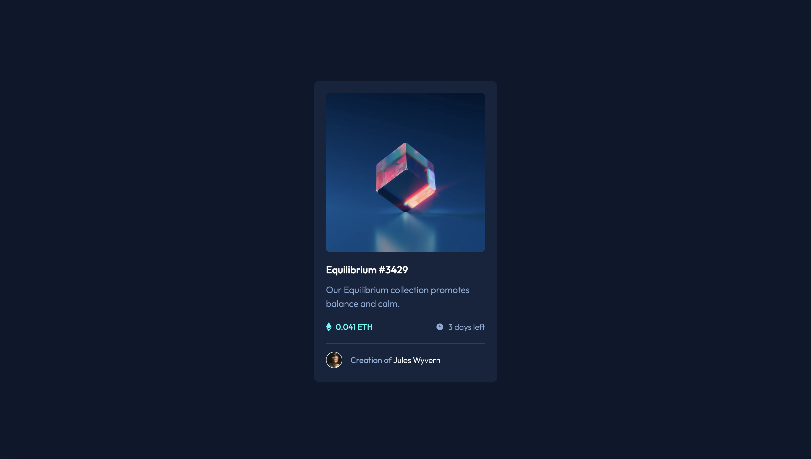

# Frontend Mentor - NFT preview card component solution

This is a solution to the [NFT preview card component challenge on Frontend Mentor](https://www.frontendmentor.io/challenges/nft-preview-card-component-SbdUL_w0U). Frontend Mentor challenges help you improve your coding skills by building realistic projects.

## Table of contents

- [Overview](#overview)
  - [The challenge](#the-challenge)
  - [Screenshot](#screenshot)
  - [Links](#links)
- [My process](#my-process)
  - [Built with](#built-with)
  - [What I learned](#what-i-learned)
- [Author](#author)

## Overview

### The challenge

Users should be able to:

- View the optimal layout depending on their device's screen size
- See hover states for interactive elements

### Screenshot



### Links

- Solution URL: [https://github.com/maryam-nasir/fm-nft-preview-card](https://github.com/maryam-nasir/fm-nft-preview-card)
- Live Site URL: [https://maryam-nasir.github.io/fm-nft-preview-card](https://maryam-nasir.github.io/fm-nft-preview-card)

## My process

### Built with

- Semantic HTML5 markup
- Tailwind CSS
- Flexbox

### What I learned

While working on this project, I learnt how to group hover on elements using Tailwind CSS. A simple code snippet is as follows:

```
<div class="relative group">
    <div class="absolute hidden group-hover:block">
        <!-- Child 1 -->
    </div>
    <div class="absolute hidden group-hover:block">
        <!-- Child 2 -->
    </div>
    <div class="absolute hidden group-hover:block">
        <!-- Child 3 -->
    </div>
</div>
```

## Author

- LinkedIn - [Maryam Nasir](https://www.linkedin.com/in/maryam-nasir/)
- Frontend Mentor - [@maryam-nasir](https://www.frontendmentor.io/profile/maryam-nasir)
- Twitter - [@maryamnasir555](https://twitter.com/maryamnasir555)
